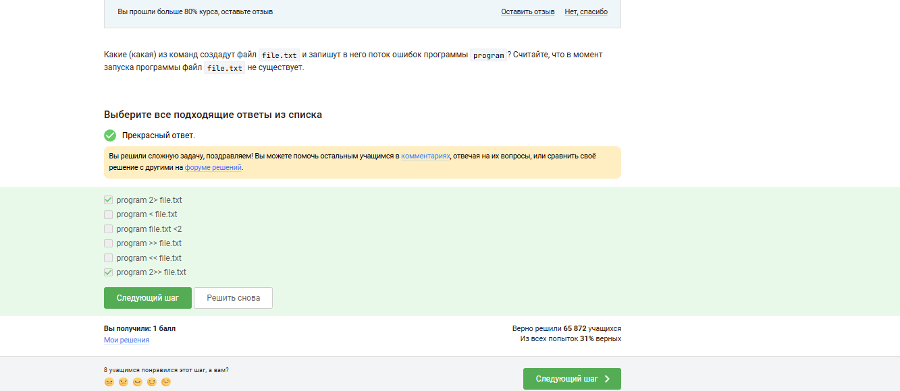
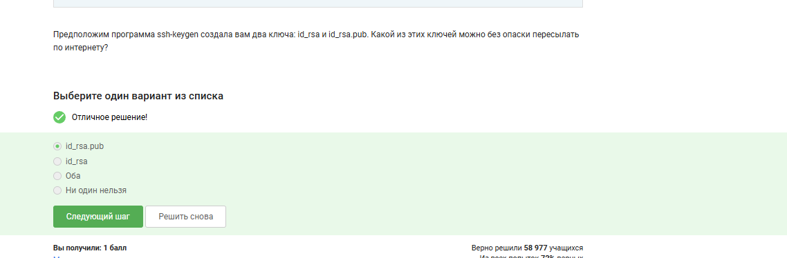
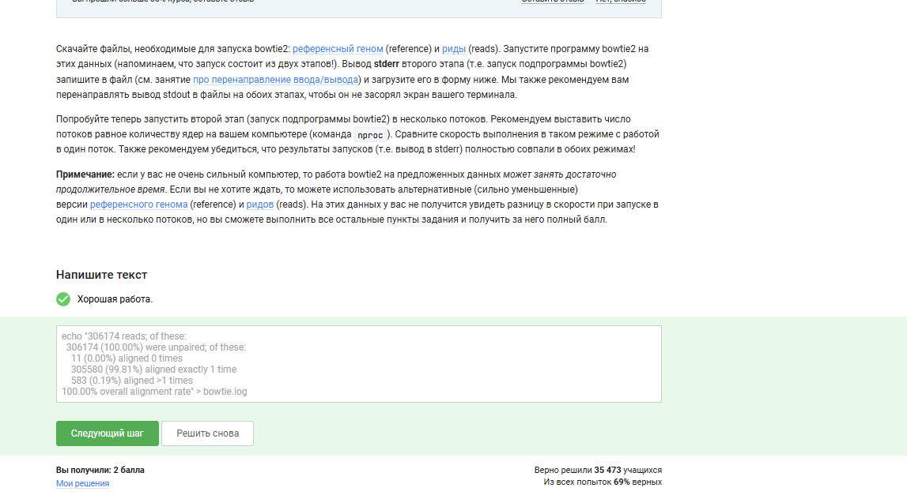
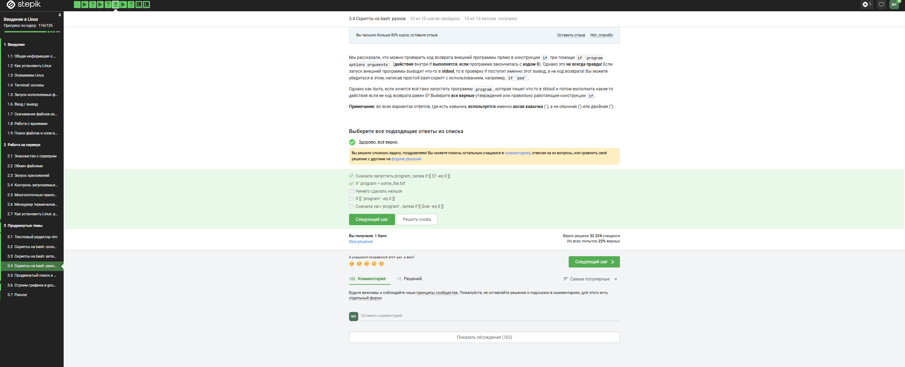

---
## Author
author:
  name: Хасанов Марат Наилович 
  degrees: DSc
  orcid: 0000-0002-0877-7063
  email: 132250428@rudn.ru
  affiliation:
    - name: Российский университет дружбы народов
      country: Российская Федерация
      postal-code: 117198
      city: Москва
      address: ул. Миклухо-Маклая, д. 6

## Title
title: "Лабораторная работа по внешнему курсу"

license: "CC BY"
---

# Информация

## Докладчик

:::::::::::::: {.columns align=center}
::: {.column width="70%"}

  * Хасанов Марат Наилович 
  * Студент НКА-07-25
  * Российский университет дружбы народов им. П. Лумумбы
  * [1132250428@rudn.ru](mailto:1132250428@rudn.ru)
  * <https://github.com/doter2007/study_2025-2026_os-intro>

:::
::: {.column width="30%"}

:::
::::::::::::::

#  Цель работы

Познакомится с линуксом и узнать что-то новое

# Выполнение лабораторной работы
# Раздел 1

## 

## 

## 

## 

{#fig-004 width=70%}

# Раздел 2

##

## Удаляю каталог newdir

# Раздел 3 
## 

## 

## Выводы

Мы познакомились с линуксом и узнали много  нового о работе сервером и скриптах в Bash

:::
