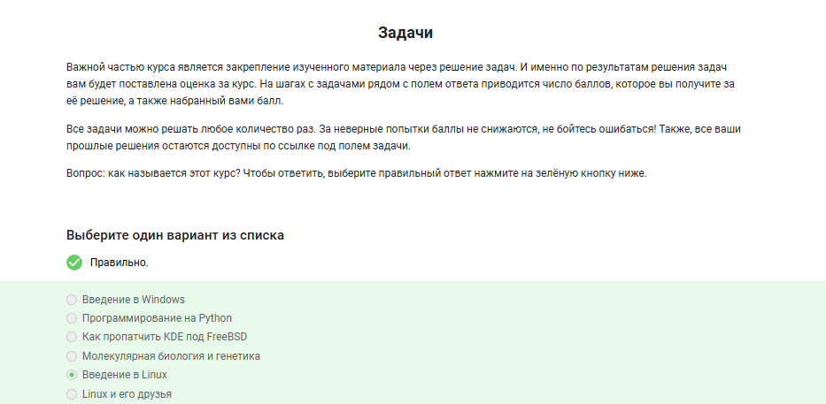
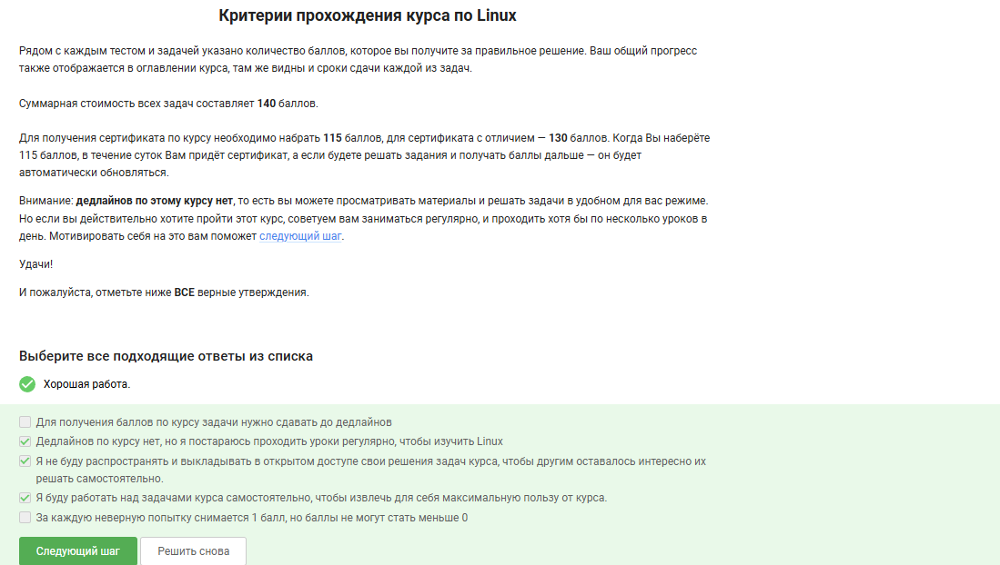
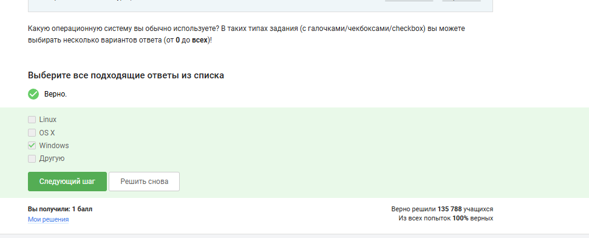
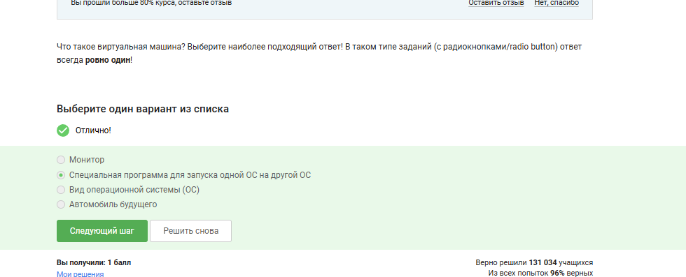

---
## Author
author:
  name: Хасанов Марат Наилович 
  degrees: DSc
  orcid: 0000-0002-0877-7063
  email: 132250428@rudn.ru
  affiliation:
    - name: Российский университет дружбы народов
      country: Российская Федерация
      postal-code: 117198
      city: Москва
      address: ул. Миклухо-Маклая, д. 6

## Title
title: "Лабораторная работа по разделу №1"

license: "CC BY"
---

# Цель работы

Познакомиться с оперционной системой linux

# Задание

Выполнить задания в разделе 1.

# Выполнение лабораторной работы

  Так как вопросы были очень легкие и практически не требующие объяснения, например: какой системой вы пользуетесь и тд, прикреплб просто скиншоты ответов на некоторые вопросы. 
 ([рис. @fig-001]).

{#fig-001 width=70%}

 ([рис. @fig-002]).

{#fig-002 width=70%}

 ([рис. @fig-003]).

{#fig-003 width=70%}

 ([рис. @fig-004]).

{#fig-004 width=70%}

# Выводы

Мы познакомились с linux снова

# Список литературы{.unnumbered}

::: {#refs}
:::
